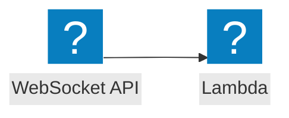

<script>
import Callout from '@design-system/components/Callout.svelte'
</script>


<Callout data-theme="warn">
This page is a work in progress. If you want to help us to make this page better, please consider contributing on GitHub.
</Callout>

## Event flow



## AWS Documentation
- [Using AWS Lambda with Amazon API Gateway](https://docs.aws.amazon.com/lambda/latest/dg/services-apigateway.html)
- [Working with WebSocket APIs](https://docs.aws.amazon.com/apigateway/latest/developerguide/apigateway-websocket-api.html)

## Example
```javascript
import middy from '@middy/core'
import wsJsonBodyParserMiddleware from '@middy/ws-json-body-parser'
import wsResponseMiddleware from '@middy/ws-response'
import wsRouterHandler from '@middy/ws-router'

import { handler as connectHandler } from './handlers/connect.js'
import { handler as disconnectHandler } from './handlers/disconnect.js'
import { handler as defaultHandler } from './handlers/default.js'

const routes = [
  {
    routeKey: '$connect',
    handler: connectHandler
  },
  {
    routeKey: '$disconnect',
    handler: disconnectHandler
  },
  {
    routeKey: 'default',
    handler: defaultHandler
  }
]

export const handler = middy()
  .use(wsJsonBodyParserMiddleware())
  .use(wsResponseMiddleware())
  .handler(wsRouterHandler(routes))

```
