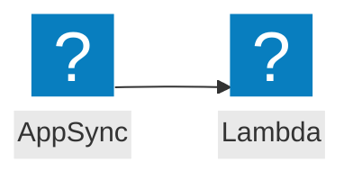

<script>
import Callout from '@design-system/components/Callout.svelte'
</script>


<Callout data-theme="warn">
This page is a work in progress. If you want to help us to make this page better, please consider contributing on GitHub.
</Callout>

## Event flow



## AWS Documentation

- [Using AWS Lambda with AppSync](https://docs.aws.amazon.com/appsync/latest/devguide/resolver-context-reference.html)

## Example

```javascript
import middy from '@middy/core'

export const handler = middy().handler((event, context, { signal }) => {
  // ...
})
```
