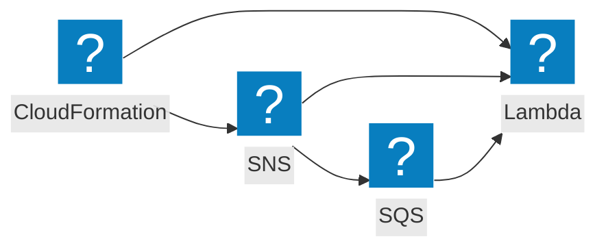

<script>
import Callout from '@design-system/components/Callout.svelte'
</script>


<Callout data-theme="warn">
This page is a work in progress. If you want to help us to make this page better, please consider contributing on GitHub.
</Callout>

## Event flow



Every hop through SNS, SQS, EventBridge, or EventBridge Pipes wraps the event Lambda receives in that service's envelope. [`@middy/event-normalizer`](/docs/middlewares/event-normalizer) unwraps the SNS and SQS envelopes.

## AWS Documentation
- [Using AWS Lambda with AWS CloudFormation](https://docs.aws.amazon.com/lambda/latest/dg/services-cloudformation.html)

## Example
```javascript
import middy from '@middy/core'
import cloudformationRouterHandler from '@middy/cloudformation-router'
import cloudformationResponseMiddleware from '@middy/cloudformation-response'
import validatorMiddleware from '@middy/validator'

const createHandler = middy()
  .use(validatorMiddleware({eventSchema: {...} }))
  .handler((event, context) => {
    return {
      PhysicalResourceId: '...',
      Data:{}
    }
  })

const updateHandler = middy()
  .use(validatorMiddleware({eventSchema: {...} }))
  .handler((event, context) => {
    return {
      PhysicalResourceId: '...',
      Data: {}
    }
  })

const deleteHandler = middy()
  .use(validatorMiddleware({eventSchema: {...} }))
  .handler((event, context) => {
    return {
      PhysicalResourceId: '...'
    }
  })

const routes = [
  {
    requesType: 'Create',
    handler: createHandler
  },
  {
    requesType: 'Update',
    handler: updateHandler
  },
  {
    routeKey: 'Delete',
    handler: deleteHandler
  }
]

export const handler = middy()
  .use(cloudformationResponseMiddleware())
  .handler(cloudformationRouterHandler(routes))
```
