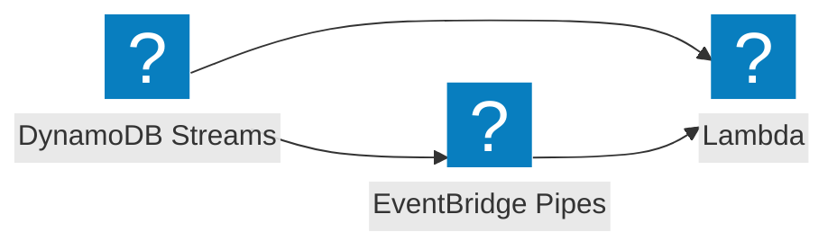

Process DynamoDB Streams (table change-data-capture) in a Lambda triggered by a stream event source mapping.

## Event flow



Every hop through SNS, SQS, EventBridge, or EventBridge Pipes wraps the event Lambda receives in that service's envelope. [`@middy/event-normalizer`](/docs/middlewares/event-normalizer) unwraps the SNS and SQS envelopes.

## AWS documentation

- [Using AWS Lambda with Amazon DynamoDB](https://docs.aws.amazon.com/lambda/latest/dg/with-ddb.html)
- [Change data capture with DynamoDB Streams](https://docs.aws.amazon.com/amazondynamodb/latest/developerguide/Streams.html)
- [DynamoDB Streams Lambda Integration error handling](https://docs.aws.amazon.com/lambda/latest/dg/with-ddb.html#services-ddb-errors)

## What AWS sends

`event.Records` is a batch of change records. Each record has `eventName` (`INSERT`, `MODIFY`, `REMOVE`), `eventSource: 'aws:dynamodb'`, `dynamodb.Keys`, and depending on `StreamViewType`, `dynamodb.NewImage` and/or `dynamodb.OldImage` in DynamoDB's typed attribute format (`{ id: { S: "abc" } }`).

DynamoDB Streams use the same partial-batch checkpoint model as Kinesis: Lambda checkpoints to the lowest failed sequence number and replays from there. Use `FunctionResponseTypes: [ReportBatchItemFailures]` to report partial failures.

## Recommended middlewares

| Middleware | Why |
| --- | --- |
| [`@middy/event-normalizer`](/docs/middlewares/event-normalizer) | Unmarshal `NewImage` / `OldImage` from typed format to plain JS |
| [`@middy/event-batch-handler`](/docs/handlers/event-batch-handler) | Per-record handler |
| [`@middy/event-batch-response`](/docs/middlewares/event-batch-response) | Report `batchItemFailures` |

## Example

```javascript
import middy from '@middy/core'
import eventNormalizer from '@middy/event-normalizer'
import eventBatchResponse from '@middy/event-batch-response'
import eventBatchHandler from '@middy/event-batch-handler'

const recordHandler = async (record, context) => {
  if (record.eventName === 'REMOVE') return // ignore deletes
  // record.dynamodb.NewImage is now plain JS (event-normalizer unmarshalled it)
  await indexItem(record.dynamodb.NewImage)
}
const lambdaHandler = eventBatchHandler(recordHandler)

export const handler = middy()
  .use(eventNormalizer())
  .use(eventBatchResponse())
  .handler(lambdaHandler)
```

## With Durable Functions

DynamoDB Streams use the same partial-batch checkpoint model as Kinesis. Wrapping the handler in `withDurableExecution` lets `event-batch-handler` auto-checkpoint each record so prior writes (e.g. to a search index, cache, or downstream API) do not repeat on replay.

```javascript
import { withDurableExecution } from '@aws/durable-execution-sdk-js'
import middy from '@middy/core'
import eventNormalizer from '@middy/event-normalizer'
import eventBatchResponse from '@middy/event-batch-response'
import eventBatchHandler from '@middy/event-batch-handler'

const recordHandler = async (record, ctx) => {
  const change = record.dynamodb
  await ctx.step('index', async () => searchIndex.upsert(change.NewImage))
  await ctx.step('audit', async () => auditLog.write(change))
}
const lambdaHandler = eventBatchHandler(recordHandler)

export const handler = withDurableExecution(
  middy()
    .use(eventNormalizer())
    .use(eventBatchResponse())
    .handler(lambdaHandler)
)
```

## IaC: required event source mapping

Set `FunctionResponseTypes: [ReportBatchItemFailures]` on the event source mapping.

## Common gotchas

- **`OldImage` only present with the right `StreamViewType`.** Set `NEW_AND_OLD_IMAGES` (or `OLD_IMAGE`) on the table stream if you need it.
- **`REMOVE` records have no `NewImage`.** Handle deletes explicitly.
- **Whole-batch replay.** Without `ReportBatchItemFailures`, any error replays the whole batch and everything after it - quickly catastrophic.
- **Hot shards.** A single partition key writing rapidly can throttle the consumer. Increase `ParallelizationFactor` on the event source mapping.

## Related

- [`@middy/event-normalizer`](/docs/middlewares/event-normalizer)
- [`@middy/dynamodb`](/docs/middlewares/dynamodb) - fetch config from DynamoDB tables
- [Kinesis Streams](/docs/events/kinesis-streams)
