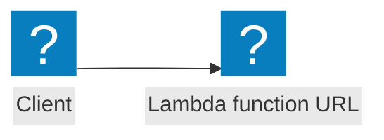

Same as API Gateway (HTTP), but with support for response streams.

## Event flow



## AWS Documentation

- [Using AWS Lambda with Amazon API Gateway](https://docs.aws.amazon.com/lambda/latest/dg/services-apigateway.html)
- [Working with HTTP APIs](https://docs.aws.amazon.com/apigateway/latest/developerguide/http-api.html)

## Example

```javascript
import middy from '@middy/core'
import { executionModeStreamifyResponse } from '@middy/core/StreamifyResponse'
import errorLoggerMiddleware from '@middy/error-logger'
import eventLoggerMiddleware from '@middy/event-logger'
import responseLoggerMiddleware from '@middy/response-logger'
import httpContentNegotiationMiddleware from '@middy/http-content-negotiation'
import httpContentEncodingMiddleware from '@middy/http-content-encoding'
import httpCorsMiddleware from '@middy/http-cors'
import httpErrorHandlerMiddleware from '@middy/http-error-handler'
import httpEventNormalizerMiddleware from '@middy/http-event-normalizer'
import httpHeaderNormalizerMiddleware from '@middy/http-header-normalizer'
import httpJsonBodyParserMiddleware from '@middy/http-json-body-parser'
import httpMultipartBodyParserMiddleware from '@middy/http-multipart-body-parser'
import httpPartialResponseMiddleware from '@middy/http-partial-response'
import httpResponseSerializerMiddleware from '@middy/http-response-serializer'
import httpSecurityHeadersMiddleware from '@middy/http-security-headers'
import httpUrlencodeBodyParserMiddleware from '@middy/http-urlencode-body-parser'
import httpUrlencodePathParametersParserMiddleware from '@middy/http-urlencode-path-parser'
import validatorMiddleware from '@middy/validator'
import { transpileSchema } from '@middy/validator/transpile'
import warmupMiddleware from '@middy/warmup'

import eventSchema from './eventSchema.json' with { type: 'json' }
import responseSchema from './responseSchema.json' with { type: 'json' }

export const handler = middy({
  timeoutEarlyResponse: () => {
    return {
      statusCode: 408
    }
  },
  executionMode:executionModeStreamifyResponse
})
  .use(warmupMiddleware())
  .use(httpEventNormalizerMiddleware())
  .use(httpHeaderNormalizerMiddleware())
  .use(
    httpContentNegotiationMiddleware({
      availableLanguages: ['en-CA', 'fr-CA'],
      availableMediaTypes: ['application/json']
    })
  )
  .use(httpUrlencodePathParametersParserMiddleware())
  // Start oneOf
  .use(httpUrlencodeBodyParserMiddleware())
  .use(httpJsonBodyParserMiddleware())
  .use(httpMultipartBodyParserMiddleware())
  // End oneOf
  .use(httpSecurityHeadersMiddleware())
  .use(httpCorsMiddleware())
  .use(httpContentEncodingMiddleware())
  .use(
    httpResponseSerializerMiddleware({
      serializers: [
        {
          regex: /^application\/json$/,
          serializer: ({ body }) => JSON.stringify(body)
        }
      ],
      defaultContentType: 'application/json'
    })
  )
  .use(httpPartialResponseMiddleware())
  .use(
    validatorMiddleware({
      eventSchema: transpileSchema(eventSchema),
      responseSchema: transpileSchema(responseSchema)
    })
  )
  .use(httpErrorHandlerMiddleware())
  .handler((event, context, { signal }) => {
    // ...
  })
```
