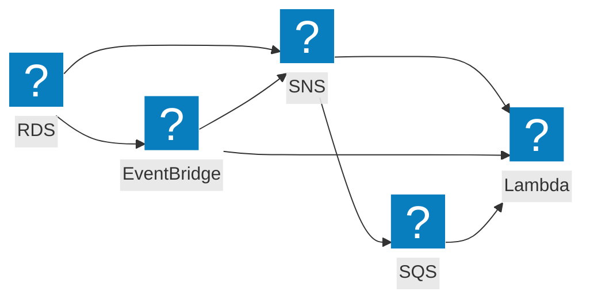

<script>
import Callout from '@design-system/components/Callout.svelte'
</script>


<Callout data-theme="warn">
This page is a work in progress. If you want to help us to make this page better, please consider contributing on GitHub.
</Callout>

## Event flow



Every hop through SNS, SQS, EventBridge, or EventBridge Pipes wraps the event Lambda receives in that service's envelope. [`@middy/event-normalizer`](/docs/middlewares/event-normalizer) unwraps the SNS and SQS envelopes.

## AWS Documentation
- [Using AWS Lambda with Amazon RDS](https://docs.aws.amazon.com/lambda/latest/dg/services-rds.html)

## Example
```javascript
import middy from '@middy/core'
import eventNormalizerMiddleware from '@middy/event-normalizer'

export const handler = middy()
  .use(eventNormalizerMiddleware()) // RDS -> SNS -> Lambda
  .handler((event, context, {signal}) => {
    // ...
  })
```
