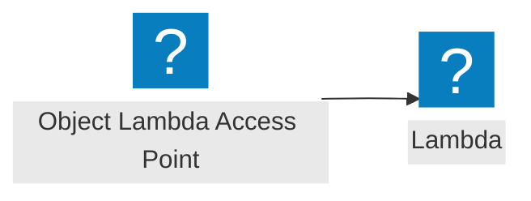

<script>
import Callout from '@design-system/components/Callout.svelte'
</script>


<Callout data-theme="warn">
This page is a work in progress. If you want to help us to make this page better, please consider contributing on GitHub.
</Callout>

<Callout data-theme="warn">
As of November 7, 2025, S3 Object Lambda is available only to existing customers and select AWS Partner Network (APN) partners. See <a href="https://docs.aws.amazon.com/AmazonS3/latest/userguide/amazons3-ol-change.html">Amazon S3 Object Lambda availability change</a>.
</Callout>

## Event flow



## AWS Documentation

- [Transforming S3 Objects with S3 Object Lambda](https://docs.aws.amazon.com/lambda/latest/dg/with-s3.html)
- [Transforming objects with S3 Object Lambda](https://docs.aws.amazon.com/AmazonS3/latest/userguide/transforming-objects.html)

## Example

```javascript
import middy from '@middy/core'
import s3ObjectResponseMiddleware from '@middy/s3-object-response'
import {captureAWSv3Client} from 'aws-xray-sdk-core'
import {captureFetchGlobal} from 'aws-xray-sdk-fetch'

captureFetchGlobal()

export const handler = middy()
  .use(s3ObjectResponseMiddleware({
    awsClientCapture: captureAWSv3Client
  }))
  .handler((event, context, {signal}) => {
    // ...
  })
```
