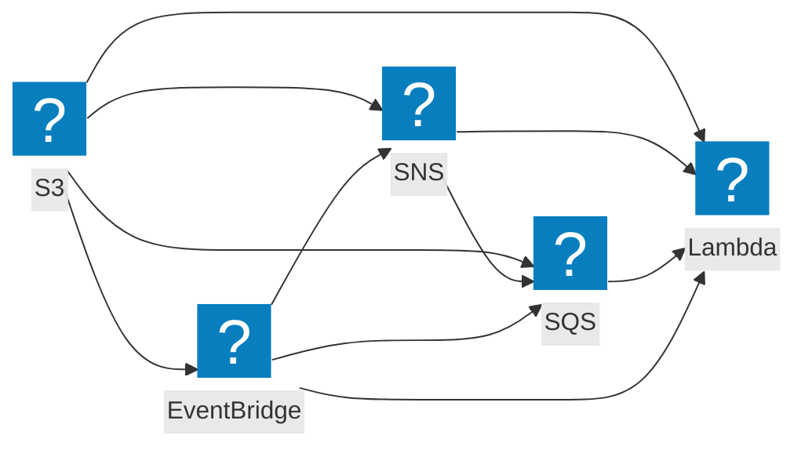

Process S3 object events (created, removed, restored) in a Lambda triggered by an S3 event notification, with or without SNS/SQS in the middle.

## Event flow



Every hop through SNS, SQS, EventBridge, or EventBridge Pipes wraps the event Lambda receives in that service's envelope. [`@middy/event-normalizer`](/docs/middlewares/event-normalizer) unwraps the SNS and SQS envelopes.

## AWS documentation

- [Using AWS Lambda with Amazon S3](https://docs.aws.amazon.com/lambda/latest/dg/with-s3.html)
- [Amazon S3 event notifications](https://docs.aws.amazon.com/AmazonS3/latest/userguide/NotificationHowTo.html)

## What AWS sends

`event.Records` is an array of S3 event records. Each record has `eventName` (`ObjectCreated:Put`, `ObjectRemoved:Delete`, etc.), `eventTime`, `s3.bucket.name`, `s3.object.key` (URL-encoded), and `s3.object.size`.

When S3 fans out via SNS or SQS, the original S3 record is nested inside the SNS/SQS envelope as a JSON string. [`@middy/event-normalizer`](/docs/middlewares/event-normalizer) walks the envelope shape `S3 -> SNS -> SQS -> Lambda` and unwraps to the original S3 record.

## Direct S3 trigger

```javascript
import middy from '@middy/core'

const lambdaHandler = async (event, context, { signal }) => {
  for (const record of event.Records) {
    const bucket = record.s3.bucket.name
    const key = decodeURIComponent(record.s3.object.key.replace(/\+/g, ' '))
    // ... process
  }
}

export const handler = middy().handler(lambdaHandler)
```

## Via SNS or SQS (recommended for fan-out / retry)

```javascript
import middy from '@middy/core'
import eventNormalizer from '@middy/event-normalizer'

export const handler = middy()
  .use(eventNormalizer()) // walks S3 -> SNS -> SQS -> Lambda envelopes
  .handler(async (event, context, { signal }) => {
    for (const record of event.Records) {
      const bucket = record.s3.bucket.name
      const key = decodeURIComponent(record.s3.object.key.replace(/\+/g, ' '))
      // ...
    }
  })
```

## With S3 Object Lambda (transform on read)

For S3 Object Lambda Access Points, see the [s3-object event](/docs/events/s3-object) and [`@middy/s3-object-response`](/docs/middlewares/s3-object-response).

## Common gotchas

- **`key` is URL-encoded.** Always `decodeURIComponent(record.s3.object.key.replace(/\+/g, ' '))`. Spaces in keys arrive as `+`.
- **Batch size is implicit.** S3 typically delivers one record per invocation, but the schema is an array. Always iterate `event.Records`.
- **No automatic retry on direct triggers.** A failed Lambda from a direct S3 notification will not retry by default; fan out via SNS or SQS for retry semantics.
- **Loops.** A Lambda triggered by `s3:ObjectCreated:*` that writes back to the same bucket will infinite-loop. Use a prefix filter or write to a different bucket.

## Related

- [`@middy/event-normalizer`](/docs/middlewares/event-normalizer)
- [`@middy/s3`](/docs/middlewares/s3) - fetch JSON config from S3
- [`@middy/s3-object-response`](/docs/middlewares/s3-object-response) - S3 Object Lambda responses
- [S3 Object event](/docs/events/s3-object)
- [S3 Batch event](/docs/events/s3-batch)
