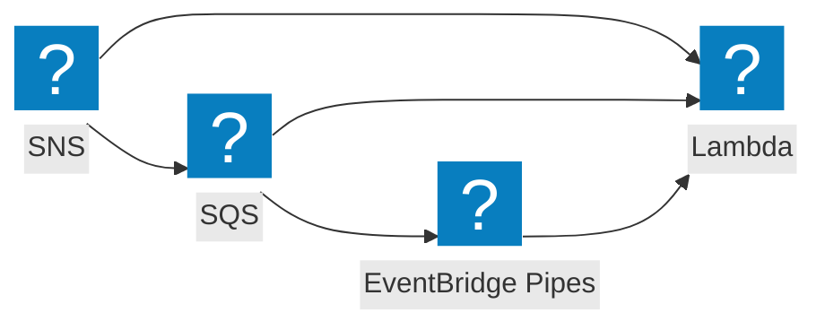

Process SNS notifications in a Lambda subscribed to an SNS topic.

## Event flow



Every hop through SNS, SQS, EventBridge, or EventBridge Pipes wraps the event Lambda receives in that service's envelope. [`@middy/event-normalizer`](/docs/middlewares/event-normalizer) unwraps the SNS and SQS envelopes.

## AWS documentation

- [Using AWS Lambda with Amazon SNS](https://docs.aws.amazon.com/lambda/latest/dg/with-sns.html)
- [Fanout to Lambda functions](https://docs.aws.amazon.com/sns/latest/dg/sns-lambda-as-subscriber.html)

## What AWS sends

`event.Records` is an array of SNS records. Each record has `EventSource: 'aws:sns'` and `Sns` with `Message` (always a string, often JSON), `MessageAttributes`, `Subject`, `Timestamp`, `TopicArn`, and `MessageId`.

SNS typically delivers one record per Lambda invocation, but the schema is still an array - always iterate.

## Recommended middlewares

| Middleware | Why |
| --- | --- |
| [`@middy/event-normalizer`](/docs/middlewares/event-normalizer) | Parse `Message` as JSON, unwrap S3-via-SNS envelopes |

## Example

```javascript
import middy from '@middy/core'
import eventNormalizer from '@middy/event-normalizer'

const lambdaHandler = async (event, context, { signal }) => {
  for (const record of event.Records) {
    // record.Sns.Message is now parsed if it was JSON
    const payload = record.Sns.Message
    // ...
  }
}

export const handler = middy()
  .use(eventNormalizer())
  .handler(lambdaHandler)
```

## Common gotchas

- **`Sns.Message` is always a string.** If you publish JSON, you have to `JSON.parse(record.Sns.Message)` or use `eventNormalizer`.
- **No partial-batch support.** SNS-to-Lambda is fire-and-forget per record. For retry semantics, fan out via SQS (SNS -> SQS -> Lambda) and use the [SQS event page](/docs/events/sqs).
- **DLQ vs on-failure destination.** Configure a DLQ or an `OnFailure` destination on the Lambda function for failed invocations; SNS itself does not redeliver.
- **Message size.** SNS has a 256 KB message limit; use the Extended Client Library if you need larger.

## Related

- [`@middy/event-normalizer`](/docs/middlewares/event-normalizer)
- [SQS event (for SNS -> SQS -> Lambda)](/docs/events/sqs)
- [EventBridge event](/docs/events/event-bridge)
