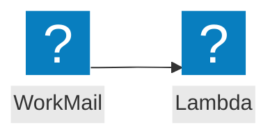

<script>
import Callout from '@design-system/components/Callout.svelte'
</script>


<Callout data-theme="warn">
This page is a work in progress. If you want to help us to make this page better, please consider contributing on GitHub.
</Callout>

<Callout data-theme="warn">
AWS ends support for Amazon WorkMail on March 31, 2027. After that date the WorkMail console and resources are no longer accessible. See <a href="https://docs.aws.amazon.com/workmail/latest/adminguide/workmail-end-of-support.html">Amazon WorkMail end of support</a>.
</Callout>

## Event flow



## AWS Documentation
- [Configuring AWS Lambda for Amazon WorkMail](https://docs.aws.amazon.com/workmail/latest/adminguide/lambda.html)

## Example
```javascript
import middy from '@middy/core'

export const handler = middy()
  .handler((event, context, {signal}) => {
    // ...
  })
```
